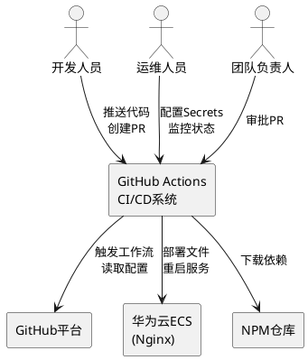
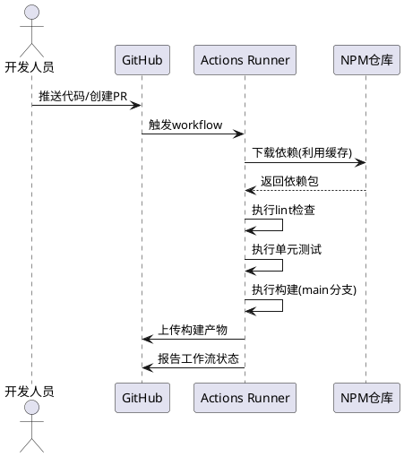
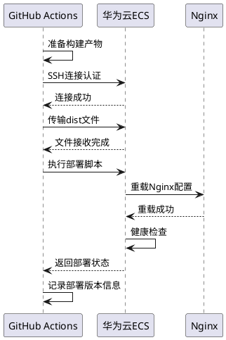
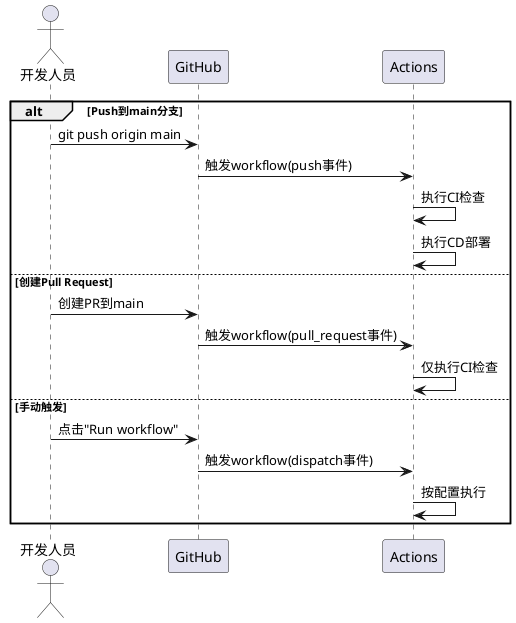

# **1. 组件定位**

## **1.1 核心职责**

本组件负责实现Vue 3看板应用的自动化构建与部署流程，通过GitHub Actions实现代码提交后的持续集成与持续交付能力。

## **1.2 核心输入**

1. **代码推送事件**：开发人员向GitHub仓库推送代码变更
2. **Pull Request事件**：开发人员创建或更新Pull Request
3. **仓库密钥配置**：GitHub Secrets中存储的SSH私钥、服务器IP等敏感信息
4. **工作流配置文件**：.github/workflows/目录下的YAML配置文件

## **1.3 核心输出**

1. **构建产物**：Vue 3应用的静态资源文件（dist目录）
2. **部署变更**：华为云ECS服务器上应用文件的更新
3. **流程状态通知**：构建成功/失败的GitHub Actions运行状态
4. **测试报告**：单元测试执行结果与代码检查报告

## **1.4 职责边界**

本组件不负责：
- Vue 3应用的运行时业务逻辑处理
- 华为云ECS服务器的基础设施创建与配置
- Nginx Web服务器的安装与初始配置
- SSH密钥对的生成与安全管理（仅使用已配置的密钥）
- 生产环境的数据备份与恢复操作

# **2. 领域术语**

**持续集成（CI）**
: 一种软件开发实践，开发人员频繁地将代码变更合并到主分支，每次合并后自动执行构建和测试，快速发现集成错误。

**持续交付（CD）**
: 在持续集成的基础上，将通过测试的代码自动部署到生产环境或准生产环境，确保软件随时可发布。

**GitHub Actions工作流**
: 定义在YAML文件中的自动化流程，包含一个或多个作业（Job），每个作业包含一系列步骤（Step）。

**GitHub Secrets**
: GitHub仓库中加密存储的敏感信息，如SSH私钥、访问令牌等，在运行时注入工作流中。

**华为云ECS**
: 华为云提供的弹性云服务器服务，本项目中作为Vue 3应用的部署目标环境。

**Nginx**
: 高性能Web服务器，用于托管Vue 3应用的静态资源文件。

**SSH私钥**
: 用于SSH协议身份验证的私钥文件，实现从GitHub Actions到华为云ECS的安全连接。

**构建缓存**
: GitHub Actions中保存的依赖包或构建产物的缓存，用于加速后续构建过程。

**部署回滚**
: 当新版本部署失败或出现问题时，自动恢复到上一稳定版本的操作。

# **3. 角色与边界**

## **3.1 核心角色**

- **开发人员**：负责编写代码、提交变更、创建Pull Request
- **运维人员**：负责配置GitHub Secrets、维护部署环境、监控部署状态
- **团队负责人**：负责审批Pull Request、制定分支保护策略

## **3.2 外部系统**

- **GitHub平台**：托管代码仓库、执行Actions工作流、管理Secrets
- **华为云ECS服务器**：部署目标环境，运行Nginx并托管静态资源
- **NPM仓库**：提供Node.js依赖包下载服务
- **通知渠道（可选）**：如企业微信、Slack等，接收构建和部署通知

## **3.3 交互上下文**

# **4. DFX约束**

## **4.1 性能**

1. **构建时间约束**
   - The GitHub Actions workflow shall complete the full CI pipeline (lint + test + build) within 5 minutes for a standard Vue 3 project with less than 100 dependencies.
   
2. **部署时间约束**
   - The deployment process shall complete within 2 minutes after successful build, including file transfer and Nginx reload.

3. **缓存命中率**
   - When dependencies are unchanged, the GitHub Actions shall achieve at least 70% cache hit rate to reduce build time.

## **4.2 可靠性**

1. **构建失败阻断**
   - If lint check or unit test fails, the GitHub Actions workflow shall prevent the deployment job from executing.
   
2. **部署失败回滚**
   - When deployment to Huawei Cloud ECS fails, the system shall automatically restore the previous stable version within 3 minutes.

3. **网络重试机制**
   - If SSH connection or file transfer fails due to network issues, the deployment process shall retry up to 3 times with exponential backoff.

4. **工作流状态可追溯**
   - The GitHub Actions shall preserve workflow execution logs for at least 30 days for troubleshooting purposes.

## **4.3 安全性**

1. **敏感信息加密**
   - The GitHub Actions workflow shall never expose secrets in plain text in logs or artifacts.
   
2. **SSH密钥管理**
   - The SSH private key shall be stored only in GitHub Secrets with restricted access permissions.
   
3. **分支保护**
   - When a pull request targets the main branch, the workflow shall require successful CI checks before allowing merge.

4. **最小权限原则**
   - The SSH user used for deployment shall have only the minimum necessary permissions for the application directory.

## **4.4 可维护性**

1. **工作流日志规范**
   - The GitHub Actions workflow shall generate structured logs with timestamps and clear step separators for easy debugging.
   
2. **通知机制**
   - When a workflow fails on the main branch, the system shall send notification to the development team within 1 minute.

3. **版本标记**
   - Each deployment shall create a version marker file containing the commit SHA and deployment timestamp.

## **4.5 兼容性**

1. **Node.js版本**
   - The GitHub Actions workflow shall support Node.js 18.x and 20.x LTS versions.
   
2. **操作系统兼容**
   - The build process shall run on GitHub-hosted ubuntu-latest runner, while deployment target is CentOS/Ubuntu Linux.

3. **配置向后兼容**
   - When the workflow configuration file is updated, it shall not break existing running workflows for at least one major version.

# **5. 核心能力**

## **5.1 持续集成（CI）**

### **5.1.1 业务规则**

1. **代码检查规则**
   - The GitHub Actions workflow shall execute ESLint or equivalent linting tool on every pull request and push to main branch.
   - 验收条件：[提交包含代码风格问题的文件] → [工作流失败并输出详细错误信息]

2. **单元测试规则**
   - The GitHub Actions workflow shall execute all unit tests using Vitest on every pull request and push to main branch.
   - 验收条件：[提交破坏测试用例的代码] → [工作流失败并显示失败的测试用例详情]

3. **构建规则**
   - When code is pushed to the main branch, the GitHub Actions workflow shall execute `npm run build` to generate production-ready static files.
   - 验收条件：[推送代码到main分支] → [生成dist目录包含优化后的静态资源]

4. **PR验证规则**
   - When a pull request is created or updated, the GitHub Actions workflow shall execute lint and test checks but shall not trigger deployment.
   - 验收条件：[创建Pull Request] → [执行CI检查但不执行部署步骤]

5. **禁止项**
   - The CI pipeline shall never skip lint or test checks for pull requests targeting the main branch.
   - 验收条件：[配置跳过检查的PR] → [工作流强制执行所有检查]

### **5.1.2 交互流程**

### **5.1.3 异常场景**

1. **代码检查失败**
   - 触发条件：提交的代码包含ESLint错误或警告
   - 系统行为：工作流立即终止，标记为失败状态，输出详细错误位置和修复建议
   - 用户感知：GitHub PR页面显示红色❌标记，阻止合并操作

2. **单元测试失败**
   - 触发条件：一个或多个测试用例执行失败
   - 系统行为：工作流终止，输出失败测试的名称、预期值和实际值对比
   - 用户感知：GitHub Actions日志显示具体失败原因，PR检查状态为失败

3. **依赖下载失败**
   - 触发条件：NPM仓库不可用或依赖包版本不存在
   - 系统行为：工作流终止并重试下载，超过3次重试后标记失败
   - 用户感知：GitHub Actions日志显示网络错误或包不存在的详细信息

4. **构建内存溢出**
   - 触发条件：Vite构建过程中内存占用超过Runner限制
   - 系统行为：工作流被强制终止，标记为失败
   - 用户感知：GitHub Actions日志显示"JavaScript heap out of memory"错误

## **5.2 持续交付（CD）**

### **5.2.1 业务规则**

1. **自动部署触发规则**
   - When code is pushed to the main branch and CI checks pass, the GitHub Actions workflow shall automatically trigger deployment to Huawei Cloud ECS.
   - 验收条件：[成功合并代码到main分支] → [自动执行部署流程]

2. **SSH连接规则**
   - The deployment process shall use SSH protocol with private key stored in GitHub Secrets to connect to Huawei Cloud ECS.
   - 验收条件：[工作流启动部署步骤] → [使用Secrets中的SSH密钥建立安全连接]

3. **文件传输规则**
   - The deployment process shall transfer the built dist directory to /var/www/task-kanban/ on the target ECS server.
   - 验收条件：[构建成功] → [dist文件完整传输到ECS指定目录]

4. **服务重启规则**
   - When new files are deployed to ECS, the deployment process shall reload Nginx to serve the updated content.
   - 验收条件：[文件传输完成] → [Nginx服务重新加载配置]

5. **部署验证规则**
   - After deployment completes, the workflow shall verify the application is accessible by checking HTTP status code.
   - 验收条件：[部署脚本执行完成] → [通过curl验证应用可访问]

6. **禁止项**
   - The deployment workflow shall never deploy code that failed CI checks to the production environment.
   - 验收条件：[CI检查失败] → [部署步骤被跳过]

### **5.2.2 交互流程**

### **5.2.3 异常场景**

1. **SSH连接失败**
   - 触发条件：SSH私钥不正确或ECS服务器SSH服务不可用
   - 系统行为：工作流重试连接3次，每次间隔指数增长，全部失败后标记部署失败
   - 用户感知：GitHub Actions日志显示"Connection refused"或"Permission denied"错误

2. **文件传输中断**
   - 触发条件：网络不稳定导致rsync/scp传输中断
   - 系统行为：自动重试传输，保留部分传输的文件用于续传
   - 用户感知：GitHub Actions日志显示传输进度和重试次数

3. **Nginx重载失败**
   - 触发条件：Nginx配置文件存在语法错误
   - 系统行为：执行`nginx -t`验证配置，失败则回滚到上一版本并报警
   - 用户感知：部署状态显示失败，应用仍可访问旧版本

4. **磁盘空间不足**
   - 触发条件：ECS服务器磁盘空间不足以存放新的构建文件
   - 系统行为：部署失败，保留旧版本文件，输出磁盘使用情况
   - 用户感知：GitHub Actions日志显示"No space left on device"错误

5. **健康检查失败**
   - 触发条件：部署后应用无法正常响应HTTP请求
   - 系统行为：自动回滚到上一稳定版本，发送告警通知
   - 用户感知：访问应用时自动显示上一版本内容，运维人员收到告警

## **5.3 工作流触发管理**

### **5.3.1 业务规则**

1. **Push触发规则**
   - When code is pushed to the main branch, the GitHub Actions workflow shall trigger the full CI/CD pipeline including deployment.
   - 验收条件：[git push到main分支] → [触发完整工作流]

2. **Pull Request触发规则**
   - When a pull request is created or updated targeting main branch, the GitHub Actions workflow shall trigger CI checks only (lint + test).
   - 验收条件：[创建/更新PR] → [仅执行CI检查不执行部署]

3. **手动触发规则**
   - Where manual workflow dispatch is configured, the user shall be able to manually trigger the workflow with optional deployment target selection.
   - 验收条件：[用户点击"Run workflow"] → [工作流按指定参数执行]

4. **分支保护规则**
   - While branch protection is enabled on main, the workflow shall require all CI checks to pass before allowing merge.
   - 验收条件：[PR未通过CI检查] → [阻止合并到main分支]

### **5.3.2 交互流程**

### **5.3.3 异常场景**

1. **工作流配置错误**
   - 触发条件：YAML配置文件语法错误或使用了不存在的Action
   - 系统行为：GitHub拒绝执行工作流，显示配置错误详情
   - 用户感知：无法触发工作流，Actions页面显示配置错误提示

2. **并发冲突**
   - 触发条件：多个工作流同时运行，争夺相同的资源或部署目标
   - 系统行为：后续工作流排队等待或按配置取消之前运行的工作流
   - 用户感知：GitHub Actions页面显示"Queued"状态

3. **Runner不可用**
   - 触发条件：GitHub-hosted runner资源不足或维护中
   - 系统行为：工作流排队等待可用Runner，超时后标记失败
   - 用户感知：工作流长时间处于"Queued"状态

## **5.4 构建缓存管理**

### **5.4.1 业务规则**

1. **依赖缓存规则**
   - When package-lock.json has not changed, the GitHub Actions workflow shall restore cached node_modules from previous runs.
   - 验收条件：[依赖未变更] → [从缓存加载node_modules，跳过npm install]

2. **缓存失效规则**
   - When package.json or package-lock.json is modified, the GitHub Actions workflow shall invalidate the existing cache and download fresh dependencies.
   - 验收条件：[依赖版本变更] → [重新下载依赖并更新缓存]

3. **缓存存储规则**
   - After dependencies are installed, the GitHub Actions workflow shall save the node_modules directory to the cache with package-lock.json hash as the key.
   - 验收条件：[npm install完成] → [缓存被保存供后续使用]

### **5.4.2 异常场景**

1. **缓存读取失败**
   - 触发条件：缓存键不匹配或缓存已过期被清理
   - 系统行为：忽略缓存，执行完整的依赖安装流程
   - 用户感知：构建时间稍长，但不影响最终结果

2. **缓存写入失败**
   - 触发条件：缓存大小超过GitHub限制（当前为10GB）
   - 系统行为：跳过缓存保存，记录警告日志
   - 用户感知：下次构建无法使用缓存，需重新下载依赖

## **5.5 部署通知机制**

### **5.5.1 业务规则**

1. **成功通知规则**
   - When deployment to production succeeds, the workflow shall send a success notification with commit information and deployment time.
   - 验收条件：[部署成功] → [发送包含commit SHA、提交人、时间的信息]

2. **失败通知规则**
   - If deployment fails, the workflow shall send a failure notification with error details and responsible commit author.
   - 验收条件：[部署失败] → [发送包含错误信息、失败步骤、提交人的告警]

3. **通知渠道规则**
   - Where notification integration is configured, the system shall support multiple channels including GitHub Status Checks, Email, and optional webhooks (Slack/WeChat).
   - 验收条件：[配置了Webhook URL] → [通过HTTP POST发送格式化通知]

### **5.5.2 异常场景**

1. **通知发送失败**
   - 触发条件：Webhook URL不可用或网络故障
   - 系统行为：记录通知发送失败日志，但不影响部署结果
   - 用户感知：未收到通知，但可在GitHub Actions页面查看状态

# **6. 数据约束**

## **6.1 GitHub Secrets**

1. **SSH_PRIVATE_KEY**：用于SSH连接的私钥内容，必须为PEM格式，对应ECS服务器的authorized_keys中的公钥
2. **ECS_HOST**：华为云ECS服务器的公网IP地址或域名，格式为IPv4地址或有效域名
3. **ECS_USER**：SSH连接使用的用户名，必须具有/var/www/task-kanban目录的写入权限
4. **ECS_PASSWORD**（可选）：当使用密码认证时的SSH密码，优先使用密钥认证
5. **NOTIFICATION_WEBHOOK**（可选）：用于发送部署通知的Webhook URL，必须为有效的HTTPS地址

## **6.2 工作流配置参数**

1. **NODE_VERSION**：Node.js版本，支持18.x或20.x LTS版本，默认值为20
2. **APP_DIR**：应用在ECS上的部署目录，固定为/var/www/task-kanban
3. **BUILD_COMMAND**：构建命令，默认为npm run build
4. **DEPLOY_BRANCH**：触发部署的分支名称，默认为main

## **6.3 构建产物**

1. **dist目录**：Vite构建生成的静态资源目录，必须包含index.html作为入口文件
2. **产物大小**：构建后dist目录总大小应小于50MB，超过时应发出警告
3. **文件完整性**：构建产物应包含所有必要的静态资源（HTML、CSS、JS、图片等），无外部依赖

## **6.4 部署记录**

1. **版本标记文件**：每次部署后在服务器生成.version文件，包含commit SHA和时间戳
2. **日志保留期**：GitHub Actions工作流日志保留30天，服务器端部署日志保留7天
3. **回滚版本数**：服务器应保留最近3个版本的构建产物以支持快速回滚

## **6.5 环境信息**

1. **ECS操作系统**：CentOS 7.x或Ubuntu 20.04/22.04 LTS
2. **Nginx版本**：1.18或更高版本，配置为静态文件服务器
3. **应用访问地址**：http://119.3.174.235（生产环境）
